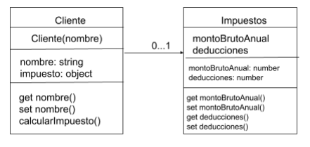

# Desafío - Clases en ES6

## Descripción

La empresa XYZ Consultores necesita un sistema para registrar la información de sus clientes y calcular el impuesto anual que deben pagar. El cálculo del impuesto se realiza mediante la siguiente fórmula:

\[ Fórmula: ((𝑚𝑜𝑛𝑡𝑜𝐵𝑟𝑢𝑡𝑜𝐴𝑛𝑢𝑎𝑙 − 𝑑𝑒𝑑𝑢𝑐𝑐𝑖𝑜𝑛𝑒𝑠) * 21%) \]

El programa debe desarrollarse en JavaScript utilizando las nuevas tecnologías de ES6, aplicando clases y métodos específicos para las operaciones. Se requiere la creación de archivos modulares para facilitar el mantenimiento del sistema y la implementación de Babel para transpilar el código ES6 a ES5.

## Requerimientos

1. **Mantener un Estilo de Código Uniforme**
2. **Utilizar ES6 para el Desarrollo del Programa**
3. **Implementar Babel**:
   - Instalar las dependencias necesarias.
   - Crear y configurar el archivo `babel.config.json`
4. **Crear Tres Archivos JavaScript**:
   - Archivo principal (main)
   - Dos archivos para cada una de las clases 
5. **Implementar Getters y Setters**
6. **Implementar Método para Calcular el Impuesto Total**
7. **Transpilar el Código de ES6 a ES5** utilizando Babel desde la terminal

## Diagrama UML

El diagrama UML proporcionado ilustra la estructura y cardinalidad de los objetos y sus propiedades. Puedes ver el diagrama aquí:

## Autor

Este proyecto fue desarrollado por **Valeria Torrealba**.
